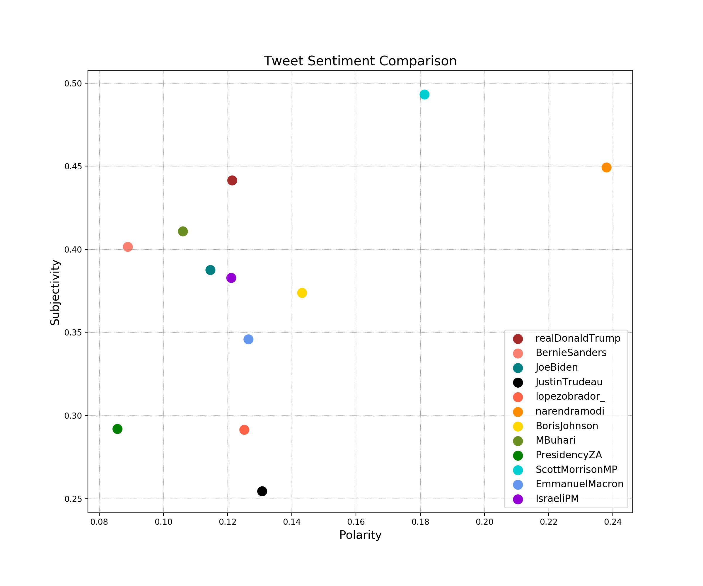

# Understanding Political Twitter with Sentiment Analysis
> Project for DIS Spring 2020: Computational Analysis of Big Data

_Authors: Duncan Grubbs and Meghan Mandi_

## 📚 Introduction

When you think of politicians and Twitter, chances are President Donald J. Trump comes to mind. Ever since he launched his run for office in 2015, Trump has become infamous for what many have described as derogatory, negative, and somewhat inflammatory tweets. Turns out that with even as little as 280 characters, he can communicate a whole spectrum of emotions, “facts”, and, believe it or not, opinions. Check out [this article by NYT](https://www.nytimes.com/interactive/2019/11/02/us/politics/trump-twitter-presidency.html) to get what we mean here. Seriously, even [Vox](https://www.vox.com/2016/5/16/11603854/donald-trump-twitter) did a study on this because Trump tweets a lot and they can be really out there.

Over the past decade, the use of political Twitter accounts has skyrocketed. Nowadays it seems like every political leader and their entire family has a Twitter account, and they all feel the need to share their opinions with all of us on the platform. In fact, many leaders use Twitter as their primary mode of communication to the public rather than public addresses or newsletters. However, this has caused some interesting problems. Often tweets aren’t vetted, and when coming from “personal” accounts rather than “official government-run communications” they can be quite polarizing or problematic. 

All of this got us thinking, how do other politicians and world leaders come across on Twitter?

## 🔨 Tools Used
- Python >= 3.6
- TextBlob
- Numpy
- WordCloud
- Matplotlib
- Google Translate API
- OMGOT3 Library

For more Check out the [blog post](https://towardsdatascience.com/understanding-political-twitter-ce3476a38377)!

